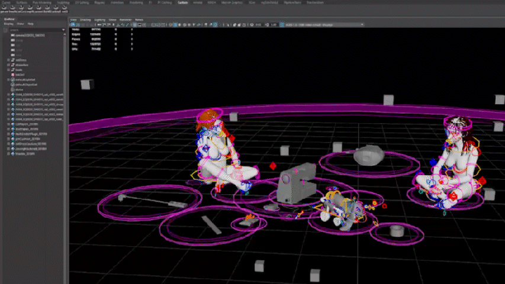

# mayaClothVariantSelector

🎯 A production-ready tool for automating character wardrobe variant application in Maya, powered by ShotGrid context and UI flexibility.

## 🔧 What It Does

- Detects the shot code from the current Maya scene name
- Loads character clothing variant data from a JSON mapping
- Optionally allows overriding the detected shot via a ShotGrid-connected dropdown (`QComboBox`)
- Applies enum-based variant values on controller nodes for characters like `constance` and `romane`
- Works both with and without ShotGrid Toolkit (`sgtk`)



## 🧰 Features

- ✅ PySide6 UI with smart detected shot label
- ✅ Optional ShotGrid shot override via dropdown (using `shotgun_api3` or `sgtk`)
- ✅ Auto-clears existing enum animation keys
- ✅ Structured, modular, and fully PEP8-compliant
- ✅ `.mod`-compatible module layout for Maya integration

## 🧪 Usage

From within Maya:

```python
exec(open(r"C:/path/to/mayaClothVariantSelector/test/test_run.py", encoding="utf-8").read())
```

Update the path in `test_run.py` to match your local install location.

---

## 🗂 Folder Structure

```
mayaClothVariantSelector/
├── core/
│   ├── maya_utils.py         # Enum/key logic and application
│   ├── shotgrid_utils.py     # ShotGrid project + shot code retrieval
│   └── variant_logic.py      # Dictionary of supported enum values
├── data/
│   └── cloth_by_shot.json    # Per-shot variant mappings
├── ui/
│   └── main_ui.py            # PySide6 interface
├── test/
│   └── test_run.py           # Reload-safe dev launcher
├── run.py                    # Entrypoint for launching UI
├── .gitignore
├── README.md
└── module/
    ├── 1.0.0/
    │   └── (Full tool mirror for Maya)
    └── 1.0.0.mod              # Maya .mod file
```

---

## 🧠 Requirements

- Maya 2025+
- PySide6 (bundled with Maya 2025)
- ShotGrid API (`shotgun_api3`) or Toolkit (`sgtk`)
- JSON-configured cloth variants

---

## 🧩 Maya Module Installation

Copy the `module/` folder to your Maya modules directory:

Example:  
`C:/Users/yourname/Documents/maya/modules/mayaClothVariantSelector/1.0.0/`

And make sure `1.0.0.mod` sits in the parent folder.

Maya will auto-load this if your environment supports `.mod` files.

---

## 📬 Author

Julien Miternique — Pipeline TD  
Built for rigging, layout, and wardrobe automation across episodic and cinematic pipelines.
